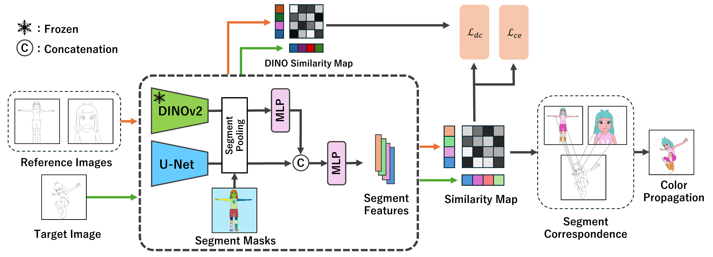

# DACoN: DINO for Anime Paint Bucket Colorization with Any Number of Reference Images (ICCV 2025)
<!--
[Paper Link](https://arxiv.org/pdf/????.????)
-->



## Usage

1. [Setup](#setup)
2. [Train](#train)
3. [Test](#test)
4. [Inference](#inference)


## Setup

Clone the repository:

```
git clone https://github.com/kzmngt/DACoN.git
```

Move to the project directory:

```
cd DACoN
```

To setup the environment, run:

```
conda create -n dacon python=3.10
conda activate dacon
pip install -r requirements.txt
```

## Train

First, you have to download the dataset from [BasicPBC](https://github.com/ykdai/BasicPBC).
Place the dataset as follows:
```
├──dataset
    ├──PaintBucket_Char_v2/
        ├──test/
        ├──train/
```

Once dowloading datasests is finished, run the following command to train DACoN from scratch:

```
python dacon/train.py \
    --config configs/train.yaml \
    --version 1_1
```

The checkpoints are saved under:
```
├──checkpoints
    ├──dacon_<STARTTIME>.pth
    ├──model_epoch_1.pth
    ├──model_epoch_2.pth
    ├──...
```
> **Note:**  
> - If `model_epoch_*.pth` files exist in this folder, training will resume from the latest checkpoint instead of starting from scratch.

## Test

You can download the pretrained checkpoints from the following links and puts under `checkpoints` folder.

|   Model    |   Download  |                                  Description                                                    |
| :--------: | :---------: | :---------------------------------------------------------------------------------------------: |
| DACoN v1.0 | [link](https://drive.google.com/file/d/1VvgLFwas_LcawrWh274BEpw2P_euOg3a/view?usp=sharing) |                                 Same architecture as paper                                      |
| DACoN v1.1 | [link](https://drive.google.com/file/d/1KJ77-aFDePmsJ6LDicJgM4pyGjagu6aI/view?usp=sharing) | Set a fixed image size during segment pooling.<br>Fuse DINO and U-Net features using simple addition instead of concat + MLP. |

You can evaluate model using the following command:

```
python dacon/test.py \
    --config configs/test.yaml \
    --model checkpoints/dacon_v1_1.pth \
    --version 1_1
```

You can control the following behaviors via the YAML configuration (test.yaml):

- Keyframe or Consecutive-frame colorization
- Number of reference images used for keyframe colorization

## Inference

You can also colorize your own anime line images. 
Please organize your data as follows:

```
├──inference
    ├──character_A
    	├──line
            ├──0.png	
            ├──1.png	
            ├──...	
    	├──ref
            ├──gt
            	├──a.png
            	├──b.png
            	├──....
            ├──line
            	├──a.png
            	├──b.png
            	├──....
    ├──character_B
    	├──line
    	├──ref
```

> **Note:**
> - Only fully enclosed line images can be colorized properly. If there are gaps in the lines, the colorization quality may be degraded.
> - When using RGB line drawings, pixels with white [255, 255, 255] are treated as the background.


After preparing your data, run the following command:

```bash
python dacon/inference.py \
    --config configs/inference.yaml \
    --model checkpoints/dacon_v1_1.pth \
    --data inference \
    --version 1_1
```

The colorized results can be found in the pred folder within each character's directory.

<!--
## Citation
If you find this work useful, please cite our paper:
```
@article{nagata2025dacon,
  title		={DACoN: DINO for Anime Paint Bucket Colorization with Any Number of Reference Images},
  author	={Kazuma, Nagata and Noashi, Kaneko},
  journal	={arXiv preprint arXiv:????.????},
  year		={2025}
}
```
-->

